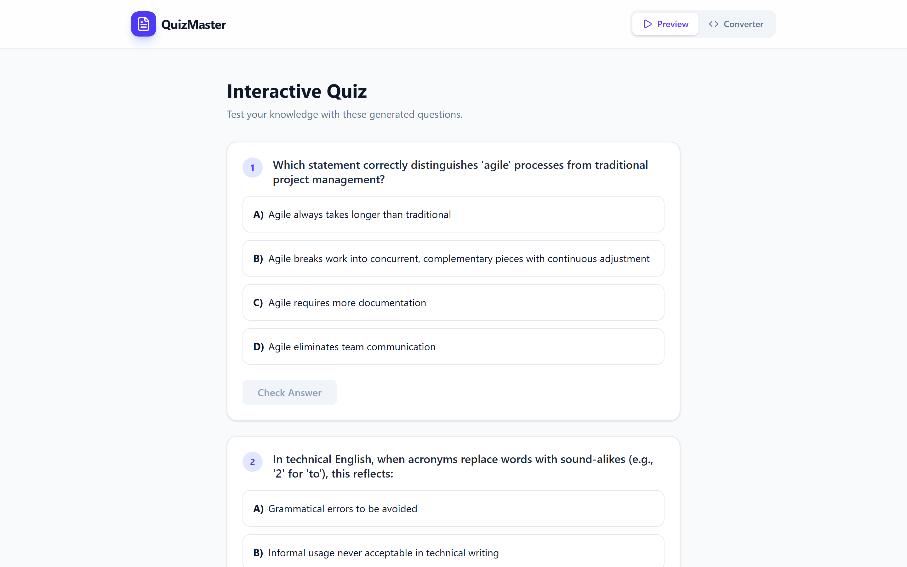
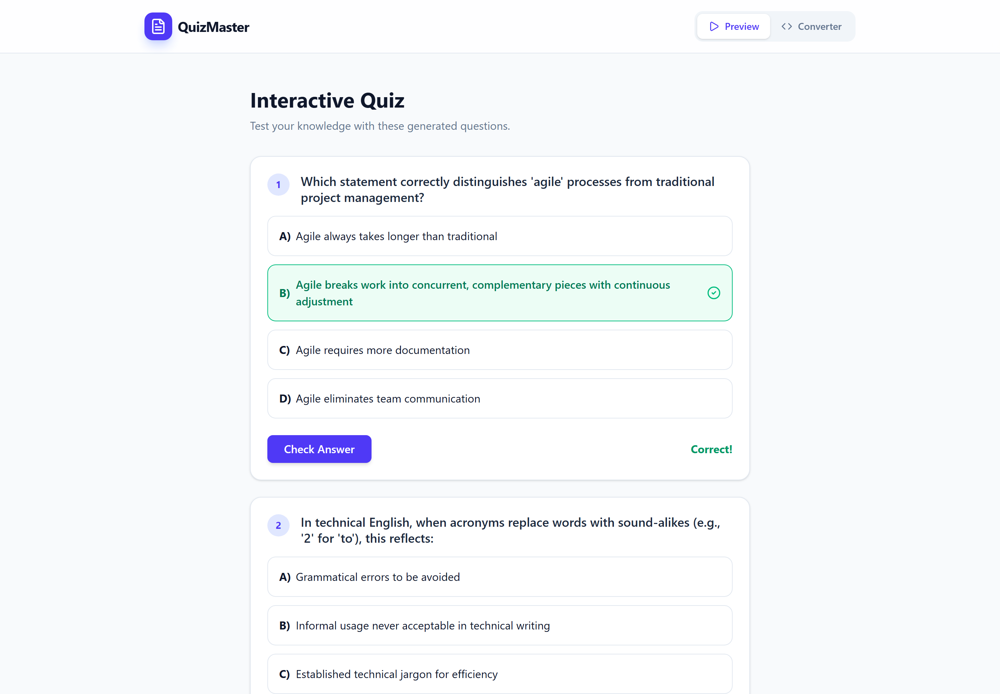
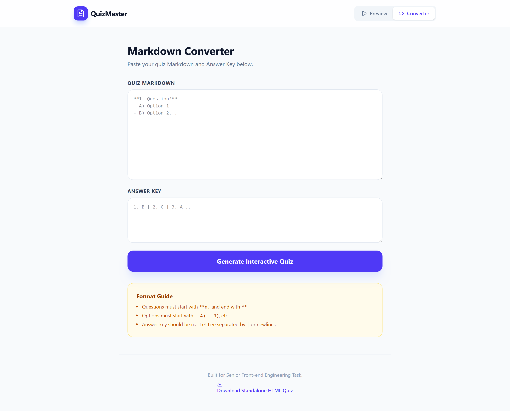

# QuizMaster: Markdown to Interactive Quiz

A front-end tool that turns plain Markdown question sets (plus an answer key) into a polished,
interactive quiz you can take in the browser, with instant correct/incorrect feedback and a
one-click export to a standalone HTML quiz.

Built with **React + Vite + TypeScript**, `motion/react` for animation, and `lucide-react` icons.

## Screenshots

### Interactive Quiz (Preview)
Generated questions rendered as clean cards with selectable options and per-question
**Check Answer** scoring.



### Answer feedback
Selecting an option and checking it highlights the correct choice in green with a
**Correct!** / incorrect indicator.



### Markdown Converter
Paste **Quiz Markdown** and an **Answer Key**, hit *Generate Interactive Quiz*, and the app
parses them into the playable quiz. Includes a format guide and **Download Standalone HTML
Quiz** export.



## Markdown format

```
**1. Your question?**
- A) Option one
- B) Option two
- C) Option three
- D) Option four
```

Answer key: `1. B | 2. C | 3. A` (separated by `|` or newlines).

## Running locally

```bash
npm install
npm run dev
```
